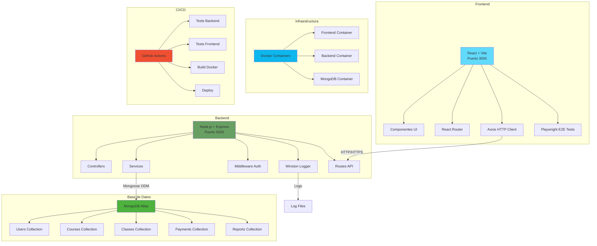
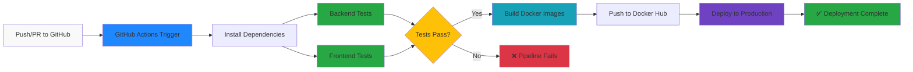

# Arquitectura del Sistema - Consultora de Idiomas

## Diagrama de Arquitectura General


*Nota: Para generar el diagrama PNG, usar el código Mermaid siguiente o las herramientas mencionadas en `images/README.md`*



## Diagrama de Pipeline CI/CD


*Nota: Aye puede mejorar/actualizar este diagrama después*



## Componentes del Sistema

### Frontend (React + Vite)
- **Puerto:** 3000
- **Tecnologías:** React 18, Vite, React Router DOM
- **Características:**
  - Interfaz de usuario moderna y responsiva
  - Enrutamiento del lado del cliente
  - Gestión de estado con hooks
  - Formularios con React Hook Form
  - Cliente HTTP con Axios

### Backend (Node.js + Express)
- **Puerto:** 5000
- **Tecnologías:** Node.js, Express, Mongoose
- **Características:**
  - API REST completa
  - Autenticación JWT
  - Middleware de autorización por roles
  - Logging con Winston
  - Validaciones con express-validator

### Base de Datos (MongoDB)
- **Tipo:** NoSQL Document Database
- **Hosting:** MongoDB Atlas (Cloud)
- **Características:**
  - Modelos discriminados para usuarios
  - Índices únicos para email y DNI
  - Relaciones entre colecciones
  - Timestamps automáticos

### Contenedores Docker
- **Frontend Container:** Nginx + React build
- **Backend Container:** Node.js + Express
- **MongoDB:** Servicio externo (Atlas)

### CI/CD Pipeline
- **Trigger:** Push o Pull Request a GitHub
- **Tests:** Backend (Jest) + Frontend (Playwright)
- **Build:** Docker images
- **Deploy:** Automático en producción

## Flujo de Datos

### 1. Autenticación
```
Usuario → Frontend → Backend API → MongoDB → JWT Token → Frontend
```

### 2. Operaciones CRUD
```
Frontend → HTTP Request → Backend Controller → Service → MongoDB → Response → Frontend
```

### 3. Logging
```
Backend Operations → Winston Logger → Log Files (app.log, error.log)
```

## Tecnologías Utilizadas

### Frontend
| Tecnología | Versión | Propósito |
|------------|---------|-----------|
| React | ^18.2.0 | Biblioteca UI |
| Vite | ^4.4.5 | Build tool |
| React Router DOM | ^7.9.1 | Enrutamiento |
| Axios | ^1.12.1 | Cliente HTTP |
| React Hook Form | ^7.62.0 | Formularios |
| Playwright | ^1.56.1 | Tests E2E |

### Backend
| Tecnología | Versión | Propósito |
|------------|---------|-----------|
| Node.js | v18+ | Runtime JavaScript |
| Express | ^4.18.2 | Framework web |
| Mongoose | ^7.5.0 | ODM MongoDB |
| JWT | ^9.0.2 | Autenticación |
| Winston | ^3.11.0 | Logging |
| bcryptjs | ^3.0.2 | Encriptación |

### Base de Datos
| Tecnología | Versión | Propósito |
|------------|---------|-----------|
| MongoDB | 6.0+ | Base de datos |
| MongoDB Atlas | Cloud | Hosting |

### DevOps
| Tecnología | Versión | Propósito |
|------------|---------|-----------|
| Docker | Latest | Contenedores |
| GitHub Actions | - | CI/CD |
| Jest | ^29.6.2 | Tests Backend |

## Seguridad

### Autenticación y Autorización
- JWT tokens con expiración de 24h
- Middleware de autenticación en todas las rutas protegidas
- Roles diferenciados: Admin, Profesor, Estudiante
- Passwords hasheados con bcryptjs

### Validaciones
- Validación de entrada con express-validator
- Sanitización de datos
- Validaciones de esquema en MongoDB
- CORS configurado para dominios específicos

### Logging y Monitoreo
- Winston logger con niveles configurables
- Logs de autenticación y errores
- Archivos de log rotativos
- Monitoreo de errores críticos

## Escalabilidad

### Horizontal
- Contenedores Docker para fácil escalado
- API stateless con JWT
- Base de datos en la nube (MongoDB Atlas)

### Vertical
- Optimización de consultas MongoDB
- Índices en campos frecuentemente consultados
- Paginación en listados grandes
- Caching de respuestas frecuentes (futuro)

## Monitoreo y Observabilidad

### Logs
- **Ubicación:** `server/logs/`
- **Niveles:** error, warn, info, debug
- **Formato:** JSON estructurado
- **Rotación:** Configurada para producción

### Métricas (Futuro)
- Tiempo de respuesta de endpoints
- Número de usuarios activos
- Errores por minuto
- Uso de recursos del servidor

## Deployment

### Desarrollo
```bash
# Frontend
cd client && npm run dev

# Backend  
cd server && npm run dev
```

### Producción
```bash
# Docker Compose
docker-compose up -d

# O individual
docker run -p 3000:80 consultora-frontend
docker run -p 5000:5000 consultora-backend
```

---

**Documentación creada por:** Vero  
**Fecha:** Noviembre 2024  
**Versión:** 1.0